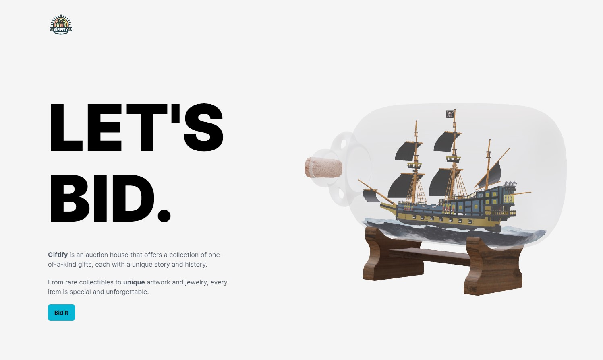
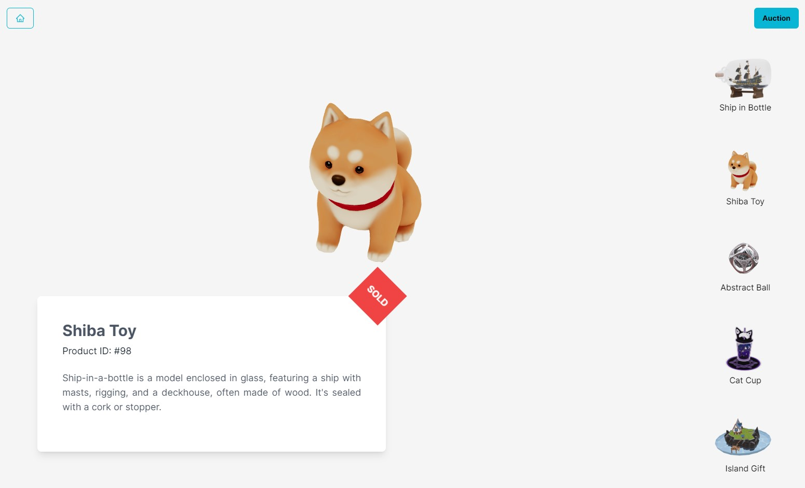
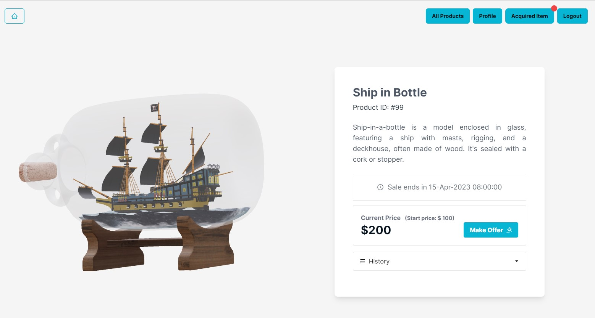
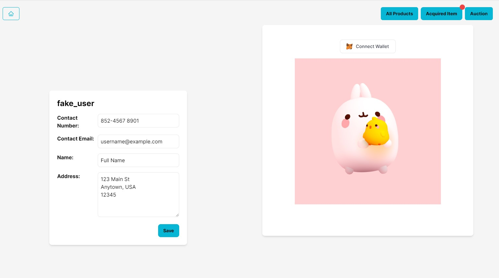
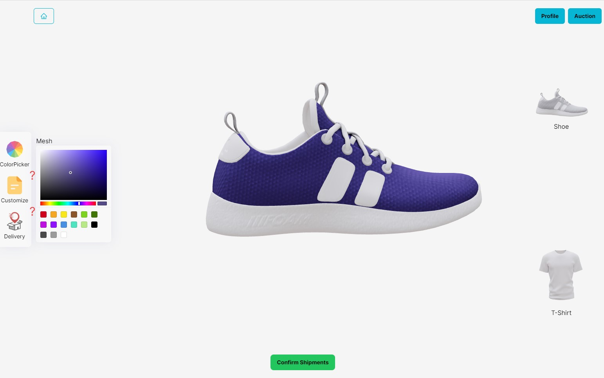
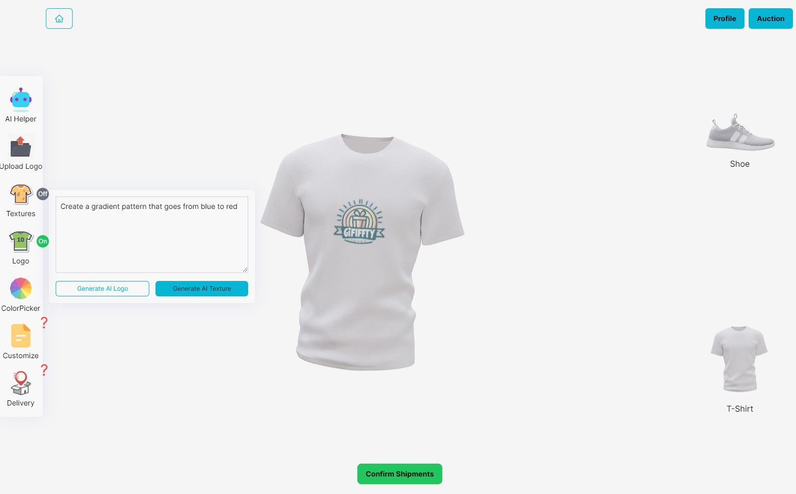

# 3D Auction House website project using three.js and OpenAI DALL-E 2

&nbsp;
&nbsp;
&nbsp;
&nbsp;

You can also see the demo in [DEMO](https://csw0126.github.io/auction_house_project/)
<br>

## Installation
1. Ensure that you have installed the latest version of Node.js and NPM on your local machine.
2. Clone this repository to your local machine using Git:

```
git clone https://github.com/CSW0126/auction_house_project.git
```

3. Install the dependencies using NPM:

```
npm install
```

4. Create the `.env` file in root directory and set the `VITE_OpenAI_KEY` variable:
To obtain a OpenAI API key, you can sign up on the [OpenAI API website](https://platform.openai.com/account/api-keys).

```
VITE_OpenAI_KEY = xxxxxxxxxxxxxxxxx
```

5. Run the VITE React app using NPM:
```
npm run dev
```
This will launch the web application in your browser. 
<br>(Example: http://127.0.0.1:5173/auction_house_project/)

## Some Screenshots
Dashboard
<br>

<br>
All Item
<br>

<br>
Auction Item
<br>

<br>
Profile
<br>

<br>
Shoe Customization
<br>

<br>
T-shirt Customization
<br>

<br>


## Credit and References:

Tutorial by JavaScript Mastery [YouTube](https://youtu.be/ZqEa8fTxypQ)<br>
Ship In Bottle by skyrn99 [Sketchfab](https://skfb.ly/6VwDq)<br>
Kawaii Skeleton Cat Cup by AnixMoonLight [Sketchfab](https://skfb.ly/oCxsy)<br>
Low Poly Medieval Island by Boooooop [Sketchfab](https://skfb.ly/6uNHF)
<br>
Shiba by zixisun02 [Sketchfab](https://skfb.ly/6WxVW)
<br>
Abstract Ball by Arigaia Sekuin [Sketchfab](https://skfb.ly/6AUX6)
